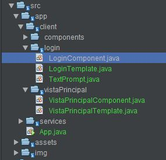
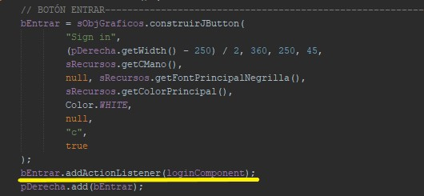
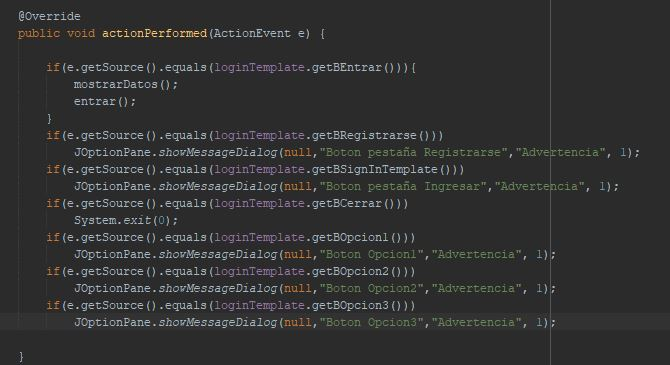
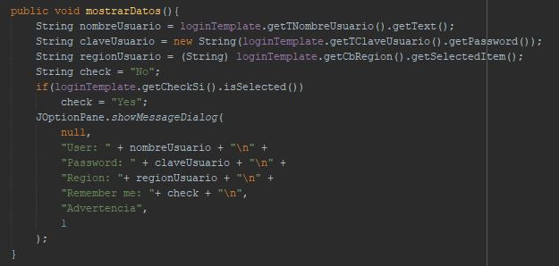
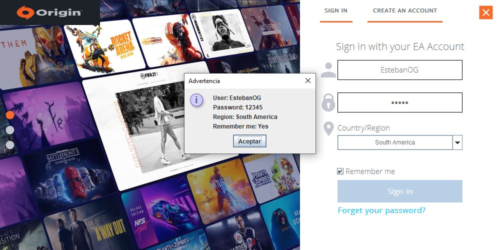
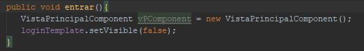
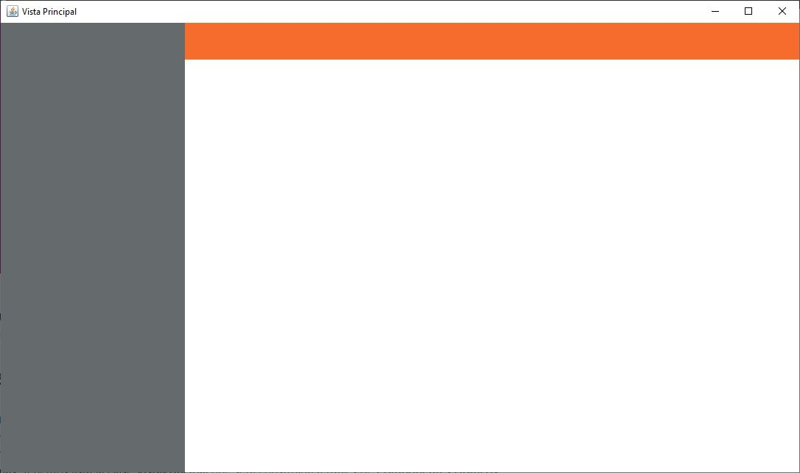

# Actividad 5

## Componentes gráficos y eventos por acción

### Componenetes gráficos

Creación de las clases componentes dentro de los distintos paquetes:

### ActionListener (Evento por acción)

Se añade método de configuración addActionListener

Método actionPerformed

### Obtención de información desde formularios

Método para obtener los datos del usuario

Resultado obtención de datos a través de evento de botón

### Abriendo otras ventanas
La comunicación entre componentes se realizará desde las clases Component.

### Preparación de la Ventana Principal

### Integrantes

| Nombre | Código  |
| :-----: | :-: |
| Juan Esteban Olaya García | 20171020135 |
| Christian Yesid Galindo Cano | 20181020111 |
