# Actividad 7

## Reutilización de componentes gráficos
### Actualización de imágenes en assets

Se actualiza la carpeta **assets/images** agregando nuevas imágenes.
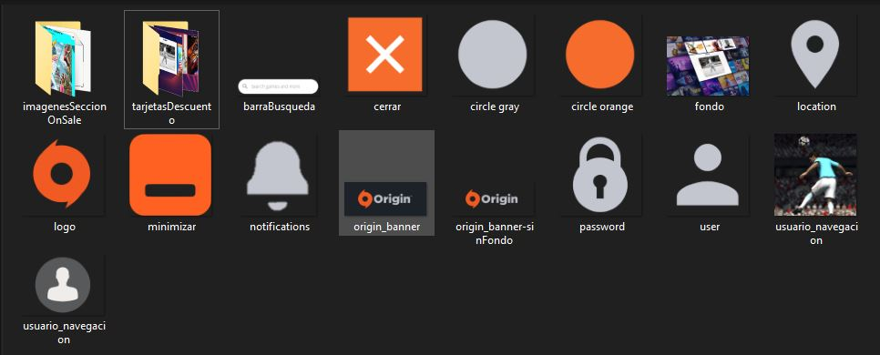

### Enfoque de reutilización por incorporación

Se crea un nuevo componenente que encapsule la estructura del contenido de los paneles superiores, el cual es llamado tarjetasDescuento.

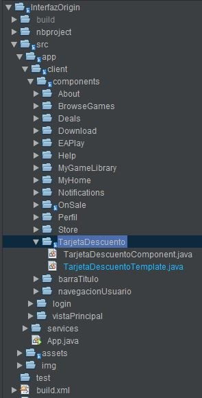

#### Declaración

##### Imagen
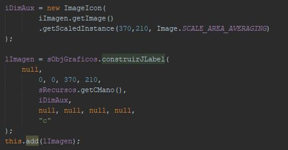
##### Titulo

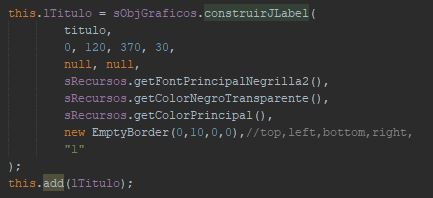
##### Parrafo

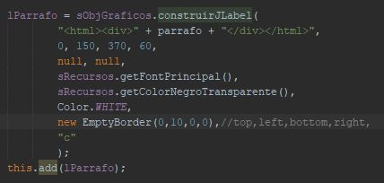

#### Ejemplificación

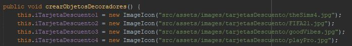

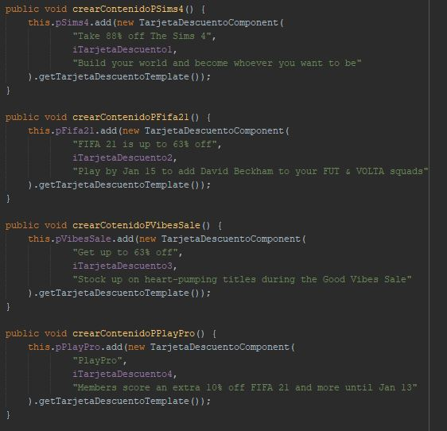

#### Resultado

### Enfoque de reutilización por Posicionamiento.

Se crea un nuevo componente que encapsule la creación del contenido de los paneles inferiores, este componente será llamado OnSale.

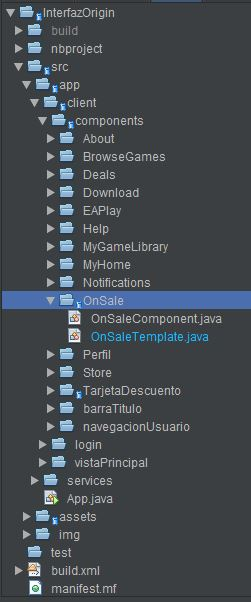

#### Declaración

##### Imagen
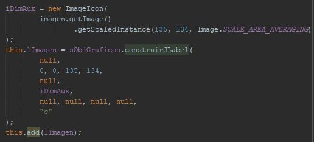
##### Titulo

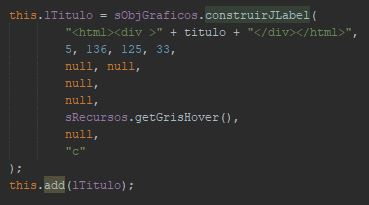
##### Precio

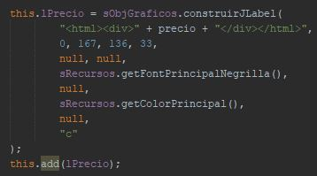
#### Ejemplificación

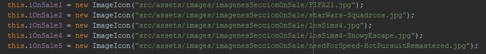

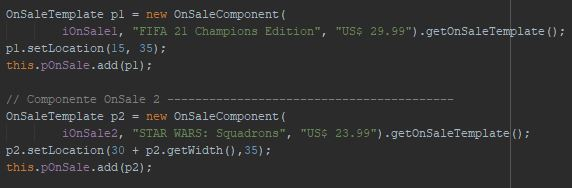

#### Resultado

### Resultado final de la actividad

### Integrantes

| Nombre | Código  |
| :-----: | :-: |
| Juan Esteban Olaya García | 20171020135 |
| Christian Yesid Galindo Cano | 20181020111 |
